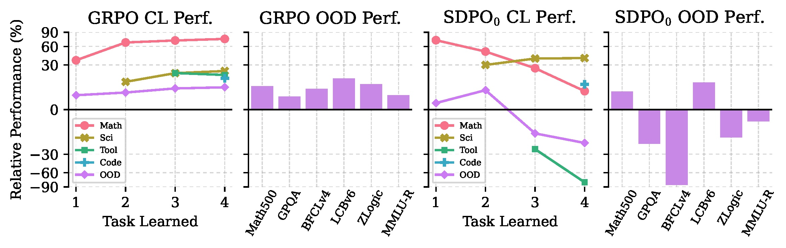
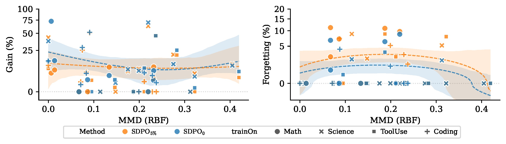
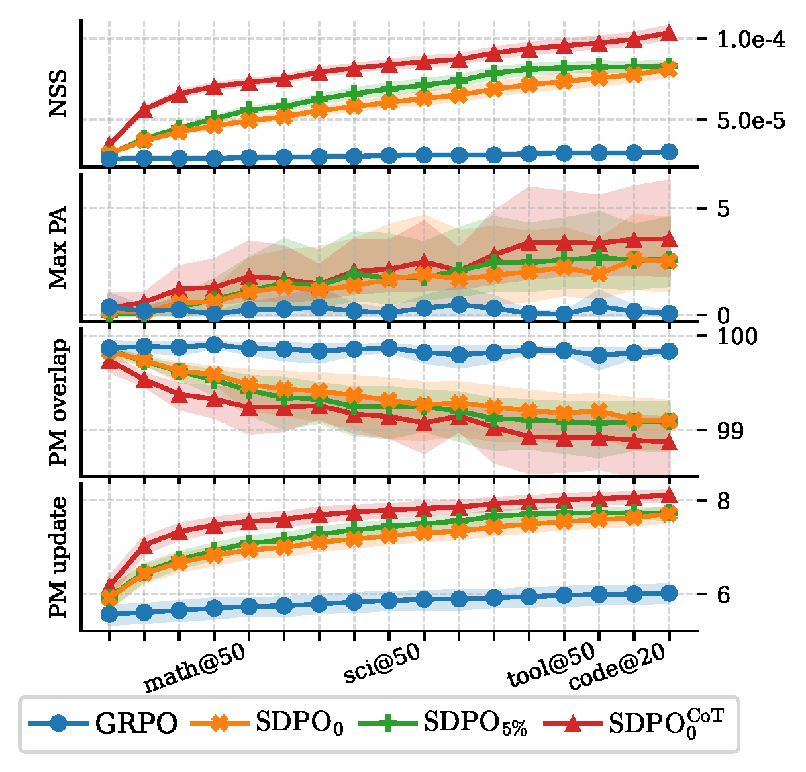
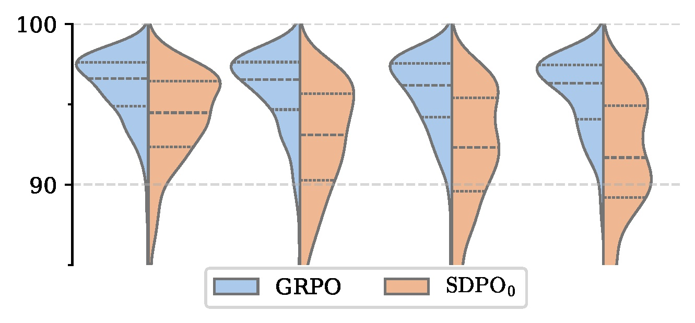

# Denser ≠ Better: Limits of On-Policy Self-Distillation for Continual Post-Training

<div align="center">
  <a href="https://arxiv.org/abs/2607.01763">
    </a>
  <a href="https://huggingface.co/papers/2607.01763">
    </a>
  <a href="https://www.apache.org/licenses/LICENSE-2.0">
    </a>
  <a href="https://github.com/Moenupa/SDPO-CL">
    </a>
  <a href="https://github.com/Moenupa/SDPO-CL/blob/main/CITATION.cff">
    </a>
</div>
<br/>

> TL;DR: **Dense token-level supervision accelerates specialization, but can hurt continual learning.**

Recent work suggests that **reinforcement learning** naturally mitigates catastrophic forgetting during continual post-training[^Path][^SDPO][^RFT]. We revisit this claim through two on-policy methods: token-level supervision **Self-Distillation Policy Optimization (SDPO)**[^SDPO] versus sequence-level rewards **Group Relative Policy Optimization (GRPO)**[^GRPO].

Our findings show that:

- 🚀 **SDPO** rapidly specializes to the current domain.
- 🎓 Self-distillation is highly sensitive to teacher **stability** and **quality**.
- ⚠️ Dense token-level supervision increases parameter drift, response drift, and forgetting.
- 📉 In continual post-training, SDPO can become unstable or even collapse.
- ✅ **GRPO** learns more conservatively while preserving prior capabilities significantly better.

## Main Findings

| Finding | Summary |
|:-------:|---------|
| **Teacher Stability** | Stable teachers outperform rapidly updated EMA teachers. |
| **CoT Distillation** | More supervision is not always better—long CoTs often amplify noise. |
| **OOD Generalization** | SDPO improves source-like tasks but hurts partially related domains. |
| **Continual Learning** | SDPO accumulates forgetting across sequential domains. |
| **Model Drift** | Dense supervision causes substantially larger parameter and response drift. |
| **Collapse** | Self-distillation can amplify formatting artifacts into catastrophic failures. |

<figure>
  
  <figcaption>GRPO consistently preserves previously learned capabilities, while SDPO forgets rapidly as more domains are introduced.</figcaption>
</figure>

<figure>
  
  <figcaption>SDPO exhibits an inverted U-shaped curve in OOD generalization across datasets.</figcaption>
</figure>

<figure>
<div align="center" justify="center">


</div>
<figcaption>Dense supervision induces much larger changes in both parameter space and response space than sequence-level RL.</figcaption>
</figure>


## Citation

```bibtex
@misc{wang2026denserneqbetterlimits,
      title={Denser $\neq$ Better: Limits of On-Policy Self-Distillation for Continual Post-Training}, 
      author={Meng Wang and Haohan Zhao and Wenzhuo Liu and Lu Yang and Geng Liu and Haiyang Guo and Guo-Sen Xie and Gaofeng Meng and Hongbin Liu and Fei Zhu},
      year={2026},
      eprint={2607.01763},
      archivePrefix={arXiv},
      primaryClass={cs.LG},
      url={https://arxiv.org/abs/2607.01763}, 
}
```

[^Path]: https://arxiv.org/abs/2511.08567 "The Path Not Taken: RLVR Provably Learns Off the Principals"
[^GRPO]: https://arxiv.org/abs/2402.03300 "DeepSeekMath: Pushing the Limits of Mathematical Reasoning in Open Language Models"
[^SDPO]: https://arxiv.org/abs/2601.20802 "Reinforcement Learning via Self-Distillation"
[^RFT]: https://arxiv.org/abs/2507.05386 "Reinforcement Fine-Tuning Naturally Mitigates Forgetting in Continual Post-Training"
