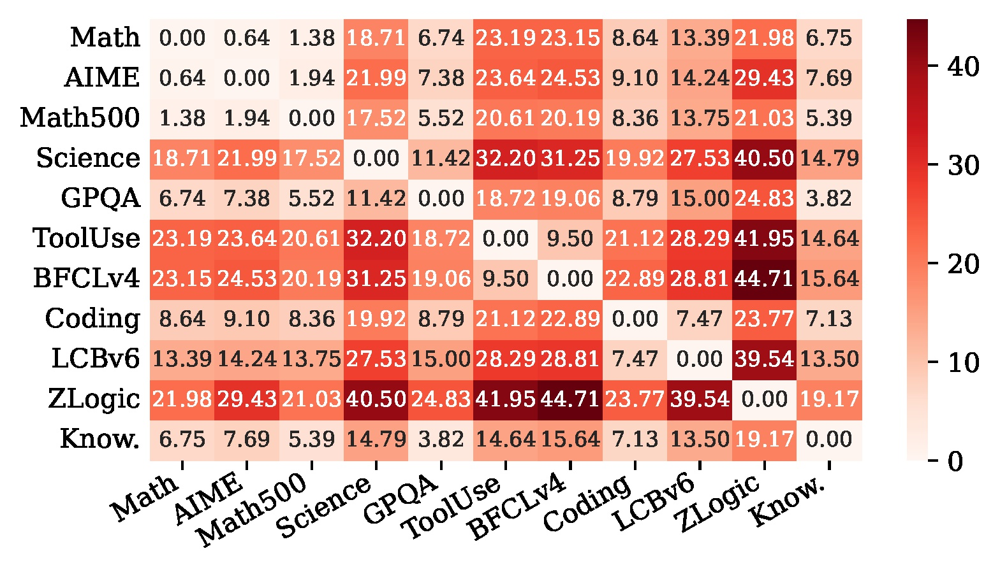
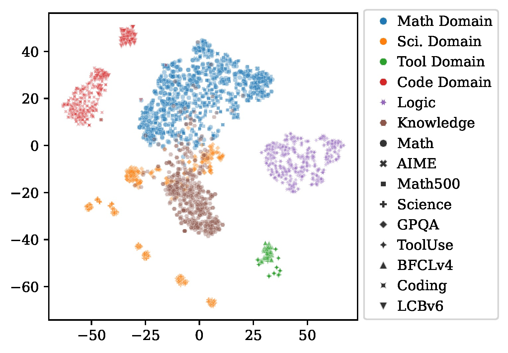

| Domain | Training | Evaluation: In-Distribution | Evaluation: Out-of-Distribution |
|---|:-:|:-:|:-:|
| Math | DAPO-Math-17k [^yu2026dapo] | AIME [^maa2024aime][^maa2025aime] | Math500 [^lightman2023lets] |
| Chemistry | SciKnowEval [^feng2024sciknoweval] | SciKnowEval [^feng2024sciknoweval] | GPQA [^rein2023gpqa] |
| Tool Use | ToolAlpaca [^tang2023toolalpaca] | ToolAlpaca [^tang2023toolalpaca] | BFCLv4 [^patil2025bfcl] |
| Code | Dolci-Think-RL-7B [^olmo2025olmo3] | Dolci-Think-RL-7B [^olmo2025olmo3] | LCBv6 [^jain2025livecodebench] |
| Logic | -- | -- | ZLogic [^lin2025zebralogic] |
| Knowledge | -- | -- | MMLU-R [^gema2024mmlu] |

[^yu2026dapo]: https://huggingface.co/datasets/BytedTsinghua-SIA/DAPO-Math-17k
[^maa2024aime]: https://huggingface.co/datasets/math-ai/aime24
[^maa2025aime]: https://huggingface.co/datasets/math-ai/aime25
[^lightman2023lets]: https://huggingface.co/datasets/math-ai/math500
[^olmo2025olmo3]: https://huggingface.co/datasets/allenai/Dolci-Think-RL-7B
[^lin2025zebralogic]: https://huggingface.co/datasets/allenai/ZebraLogicBench-private
[^gema2024mmlu]: https://huggingface.co/datasets/edinburgh-dawg/mmlu-redux-2.0
[^patil2025bfcl]: https://github.com/ShishirPatil/gorilla/blob/main/berkeley-function-call-leaderboard/bfcl_eval/data/BFCL_v4_multiple.json
[^jain2025livecodebench]: https://huggingface.co/datasets/livecodebench/code_generation_lite
[^feng2024sciknoweval]: https://huggingface.co/datasets/hicai-zju/SciKnowEval
[^tang2023toolalpaca]: https://github.com/tangqiaoyu/ToolAlpaca/tree/main/data
[^rein2023gpqa]: https://huggingface.co/datasets/Idavidrein/gpqa

<figure>
  
  <figcaption>MMD heatmap between dataset embeddings.</figcaption>
</figure>

<figure>
  
  <figcaption>t-SNE map of dataset embeddings.</figcaption>
</figure>